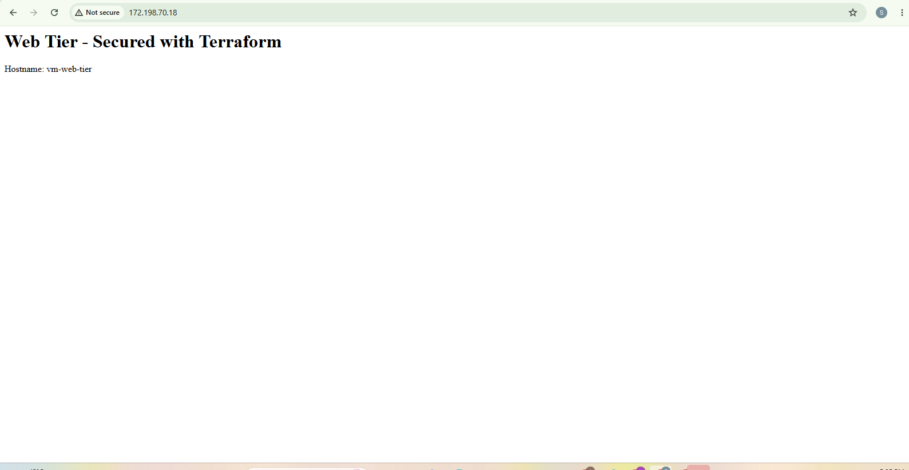
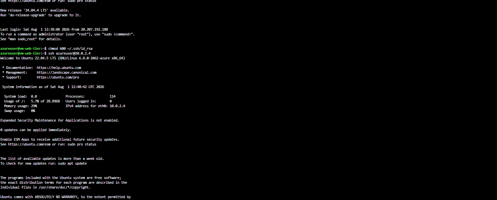
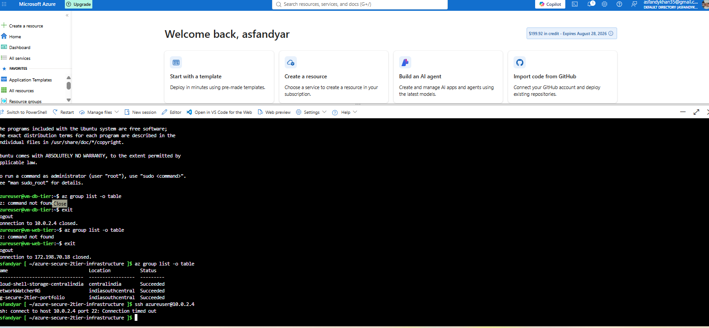

# Secure 2-Tier Web Application Infrastructure on Azure

A production-style network architecture provisioned entirely with Terraform — a public-facing web tier and a fully isolated database tier, demonstrating least-privilege network design.
## Problem
Most beginner cloud projects put everything in one flat network with no real access control. This project demonstrates the core pattern used in real production environments: the thing exposed to the internet is never the thing holding the data.
## Architecture
- VNet (10.0.0.0/16) split into two subnets
- Public subnet (10.0.1.0/24): web tier VM running nginx, with a public IP
- Private subnet (10.0.2.0/24): database tier VM, no public IP at all
- Web tier NSG: SSH restricted to a single admin IP, HTTP open to all
- Database tier NSG: SSH only accepted from the web tier's subnet range
## Key Security Decisions
- SSH on the web tier is restricted to a single admin IP (/32), not open to the world. Leaving SSH open on 0.0.0.0/0 is a common finding in real security audits.
- The database VM has no public IP at all — it is architecturally unreachable from the internet, not just firewalled.
- The database NSG only accepts SSH from the web tier's subnet range — even inside the same VNet, access is scoped to only what's needed.
- All infrastructure is defined as code — no manual portal configuration, fully reproducible via terraform apply.
## What's Deployed
- Resource Group: container for all resources
- Virtual Network + 2 Subnets: network isolation boundary
- 2 Network Security Groups: enforce least-privilege access per tier
- Public IP (Standard SKU): web tier internet access
- 2 Network Interfaces: attach VMs to their respective subnets
- 2 Linux VMs (Ubuntu 22.04): web tier (nginx) and database tier

## How to Deploy

git clone https://github.com/asfandk98/azure-secure-2tier-infrastructure.git
cd azure-secure-2tier-infrastructure
echo admin_ip = "YOUR_IP/32" > terraform.tfvars
terraform init
terraform plan
terraform apply

## Verification Performed

1. Web server accessible: confirmed nginx serving a page at the public IP
2. Internal access allowed: SSH from web tier to database tier succeeds

3. External access blocked: direct SSH attempt to the database tier from outside the web subnet times out completely

## What I Would Add at Production Scale

- Azure Bastion instead of direct SSH exposure, even restricted by IP
- Application Gateway or Load Balancer in front of the web tier for high availability
- Azure Key Vault for secrets instead of local SSH keys
- Terraform remote state using an Azure Storage backend instead of local state
- CI/CD pipeline to automate plan and apply on pull requests

## Cost Note

All resources use free-tier-eligible sizes (Standard_B1s) where possible. This project is deployed and destroyed on demand, not left running, to avoid unnecessary cost during learning.

## Security Audit (Week 9)

Performed a genuine RBAC and network security review across this project and the broader Azure subscription.

### RBAC Findings
- Confirmed the CI/CD service principal holds Contributor (not the higher-privilege Owner role) — appropriate for a pipeline that provisions and destroys full environments, without excessive administrative rights over IAM or billing
- Confirmed service principal credentials have a defined 1-year expiration rather than no expiration at all
- Identified a gap: no automated process currently tracks or triggers credential rotation ahead of expiry

### Network Security Findings and Fixes
- The web tier's SSH rule was originally scoped to a wildcard destination; tightened to reference the web VM's specific private IP address directly
- The database tier's SSH rule was originally scoped to the entire public subnet range; tightened to reference the web VM's specific private IP address instead of the broader subnet, removing the possibility of any future VM added to that subnet inheriting SSH access by default

## Secrets Management (Week 9 Addition)

Provisioned an Azure Key Vault with RBAC-based access control (not legacy access policies) as a centralized alternative to storing secrets across multiple disconnected locations (GitHub Secrets, plaintext files, etc.).

- Confirmed Key Vault requires explicit role assignment before any identity, including the creator, can read or write secrets
- Migrated the ACR registry password into Key Vault as a proof of concept
- Verified the full round trip: storing a secret, then retrieving it programmatically, exactly how a real application or pipeline would request it at runtime
- Noted that Azure CLI itself warns when displaying secret values in plaintext output, reinforcing that even convenient CLI access to secrets should be treated deliberately

### What I Would Add at Production Scale (Secrets)
- Migrate GitHub Actions to fetch secrets from Key Vault at pipeline runtime instead of storing them directly as GitHub Secrets
- Enable Key Vault diagnostic logging to Azure Monitor for a full audit trail of every secret access
- Set expiration dates on individual secrets, not just on the service principal credentials that reference them

## Cost Governance (Week 10)

Reviewed actual billing data and existing budget configuration rather than relying on assumptions.

### Findings
- Confirmed total spend across this entire multi-week learning project remained under $2, validating the consistent build-and-destroy discipline followed throughout
- Identified Azure Container Registry as the single largest cost driver (roughly 70% of total spend) — the one resource left running continuously across weeks, unlike project infrastructure which is destroyed after each session
- Audited an existing budget alert (configured in Week 1) and found all three alert thresholds had no Action Group attached — meaning the notification delivery mechanism was never actually completed, despite the budget itself appearing correctly configured
- Created a proper Action Group with a verified email receiver
- Found one alert threshold set to "Forecasted cost" instead of "Actual cost," inconsistent with the other two — corrected for consistency
- As part of this review, verified all alert recipient email addresses on the account were legitimate and recognized

### What I Would Add at Production Scale (Cost)
- Migrate cost alerting from billing-account-level budgets to Azure Monitor alert rules, which support full Action Group integration natively
- Apply consistent resource tagging (project, environment, owner) across all resources for meaningful cost attribution in Cost Management reports
- Evaluate whether an always-on resource like a container registry justifies its continuous cost, or whether a lifecycle policy should periodically clean up unused images

## Cost Estimation with Infracost (Week 10)

Ran Infracost against this project's Terraform code to generate a cost estimate before deployment, rather than discovering cost only after resources exist.

### Results
- Estimated baseline cost if run continuously: ~$7/month
- The static public IP address was the single largest individual cost driver (~$3.65/month), exceeding the cost of either VM's disk storage
- 10 of 13 resources (networking constructs: VNet, subnets, NSGs, NICs) carry no direct cost
- In practice, actual spend is far lower than this baseline, since infrastructure is provisioned only for active sessions and destroyed immediately after, consistent with the cost discipline followed throughout this project

### Why This Matters
Integrating cost estimation into the Terraform workflow itself (rather than checking a bill after the fact) allows cost impact to be reviewed as part of `terraform plan`, the same point in the process where security and correctness are already being evaluated.
